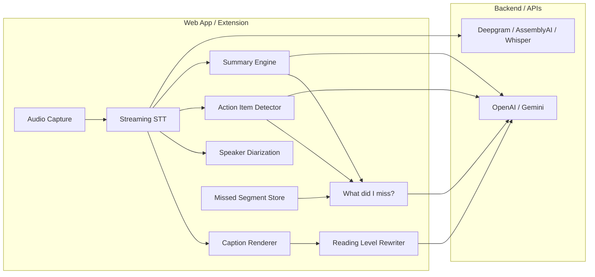

# Architecture & Tech Spec

## System overview



---

## Suggested stack

| Layer | Choice | Why |
|-------|--------|-----|
| Frontend | **Next.js 15** + React | Fast UI, API routes, good for demos |
| Styling | **Tailwind** + shadcn/ui | Accessible components, quick polish |
| STT (streaming) | **Deepgram** or **AssemblyAI** | Real-time, speaker diarization, noise tolerance |
| LLM | **OpenAI GPT-4o-mini** or **Gemini Flash** | Summaries, simplification, action extraction |
| State | **Zustand** | Caption buffer, settings, missed segments |
| Deploy | **Vercel** | One-click demo URL |

---

## Data model

```typescript
type CaptionChunk = {
  id: string;
  speaker: string;
  text: string;
  simplifiedText?: string;
  timestamp: number;
  isActionItem?: boolean;
  isDecision?: boolean;
};

type UserAccessibilitySettings = {
  readingLevel: "original" | "grade8" | "grade6";
  fontSize: number;
  captionDelaySec: number;
  contrastPreset: "default" | "high" | "dark-calm" | "dyslexia";
  reduceCognitiveLoad: boolean;
};

type ActionItem = {
  id: string;
  assignee?: string;
  task: string;
  timestamp: number;
  sourceCaptionId: string;
};

type MeetingSummary = {
  text: string;
  updatedAt: number;
  coversFromTimestamp: number;
};

type MissedSegmentRequest = {
  fromTimestamp: number;
  toTimestamp: number;
};
```

---

## API routes (Next.js)

| Route | Method | Purpose |
|-------|--------|---------|
| `/api/transcribe/stream` | WebSocket or SSE | Proxy streaming STT |
| `/api/simplify` | POST | Rewrite caption chunk to target reading level |
| `/api/summary` | POST | Generate/update rolling summary from transcript window |
| `/api/action-items` | POST | Extract action items from transcript segment |
| `/api/missed` | POST | "What did I miss?" recap for time range |

---

## Client modules

```
src/
├── app/                    # Next.js App Router pages
├── components/
│   ├── CaptionDisplay.tsx  # Main caption area with delay buffer
│   ├── AccessibilityPanel.tsx
│   ├── SummaryPanel.tsx
│   ├── ActionItemsList.tsx
│   └── MissedSegmentModal.tsx
├── hooks/
│   ├── useAudioCapture.ts  # Tab share + file upload
│   ├── useTranscription.ts # STT stream handler
│   └── useAccessibilitySettings.ts
├── stores/
│   ├── captionStore.ts
│   └── settingsStore.ts
└── lib/
    ├── stt/                # Deepgram / AssemblyAI client
    ├── llm/                # Summary, simplify, action-item prompts
    └── demo/               # Canned transcript for demo mode
```

---

## UI layout (single screen)

```
┌─────────────────────────────────────────────────────────────┐
│  Accessible Meeting Copilot          [Demo] [Live] [⚙]     │
├──────────────────────────┬──────────────────────────────────┤
│  LIVE CAPTIONS           │  ACCESSIBILITY                    │
│  (large, customizable)   │  ○ Reading level: [====●===]     │
│                          │  ○ Font size: A / A+ / A++        │
│  [Speaker 2] 10:32       │  ○ Caption delay: 5s              │
│  We need the login fix   │  ○ Contrast: High ▼               │
│  shipped by Friday.      │  ☑ Reduce cognitive load          │
│                          │                                   │
│  [Speaker 1] 10:33       │  SUMMARY (plain language)         │
│  Sarah owns the API.     │  Team agreed to ship login fix    │
│                          │  by Friday. Dashboard stays v1.   │
├──────────────────────────┴──────────────────────────────────┤
│  ACTION ITEMS          │  [ What did I miss? ]  [ Export ]   │
│  • Sarah → API fix     │                                     │
│  • Marcus → auth doc   │                                     │
└─────────────────────────────────────────────────────────────┘
```

---

## Accessibility presets

| Preset | Background | Text | Font | Notes |
|--------|------------|------|------|-------|
| Default | `#ffffff` | `#1a1a1a` | System sans | WCAG AA |
| High contrast | `#000000` | `#ffff00` | System sans | WCAG AAA |
| Dark calm | `#1e1e2e` | `#cdd6f4` | System sans | Reduced glare |
| Dyslexia-friendly | `#fdf6e3` | `#333333` | OpenDyslexic | Increased letter-spacing, line-height 1.8 |

---

## Demo mode fallback

When `DEMO_MODE=true` or live STT fails:

1. Play pre-recorded `demo-meeting.mp4`
2. Stream captions from `demo-transcript.json` on a timer (synced to audio timestamps)
3. Show badge: "Demo mode"
4. All LLM features (summary, action items, missed segment) still work against canned transcript

---

## Environment variables

```env
DEEPGRAM_API_KEY=
OPENAI_API_KEY=
# or
GEMINI_API_KEY=

NEXT_PUBLIC_DEMO_MODE=false
```
